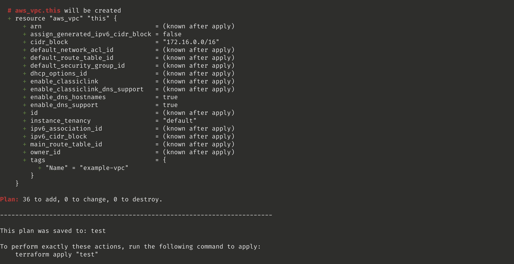

# Usage
``` bash
cd terraform/

# create .terraform folder to keep necessary modules and terraform related stuff, like .git
terraform init

# Generates necessary plan for user to see what will be generated(deployed as source like a new VPC)
terraform plan -out plan

# Self explanatory I guess.
terraform apply plan
```

An example output after plan command was applied.



### Assumptions
- I assume there's a ecr repository that is called "test" already exist on the aws. Particularly on eu-north-1 for this instance.
- I assume there's no callee for this instance. Still, I just created a run.sh file to run this script as if
there's a process(gitlab-runner/jenkins/circleCI) that runs this scrip to deploy.
